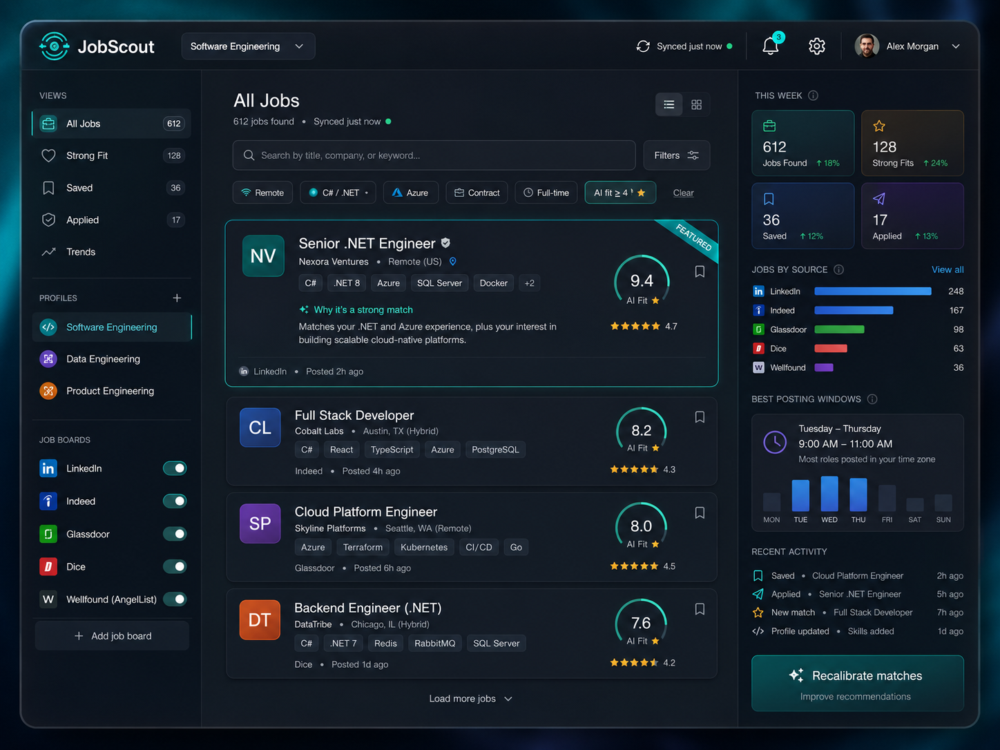

# JobScout

> AI-powered job search aggregator — finds relevant roles across multiple job boards, scores them against your resume, and learns your preferences over time.



---

## What it does

Job hunting involves checking five different sites, reading dozens of descriptions, and trying to remember which ones actually matched your experience. JobScout automates the scanning and lets AI do the first pass so you can focus on the roles that actually matter.

- **Aggregates listings** from LinkedIn (via SerpAPI), RemoteOK, Adzuna, The Muse, and more — all in one feed
- **Scores each role** against your resume using the Claude AI API (1–10 fit score with reasoning)
- **Learns your taste** — rate jobs 1–5 stars and the AI recalibrates future scoring to match your judgment
- **Tracks patterns** — see which boards surface the best fits, which days see the most postings, and whether your match rate is trending up or down
- **Supports multiple profiles** — run separate searches for completely different career paths simultaneously

---

## Tech stack

| Layer | Technology |
|---|---|
| Frontend | Blazor WebAssembly (.NET 8) |
| Backend | ASP.NET Core 8 Web API |
| Database | SQLite (dev) / Azure SQL (prod) |
| ORM | Entity Framework Core 8 |
| Scheduling | Azure Functions v4 (timer trigger) |
| AI scoring | Anthropic Claude API (`claude-sonnet-4`) |
| Job sources | SerpAPI, Adzuna API, RemoteOK, The Muse |

---

## Features

### AI fit scoring
Upload your resume (`.docx`, `.pdf`, or `.txt`) or paste your LinkedIn URL. The AI reads the full job description and your resume together and returns a score from 1–10 with a plain-English explanation of why it's a match — or why it isn't.

### User feedback loop
Rate any job 1–5 stars. Over time, JobScout includes your ratings as calibration examples in the AI prompt, nudging the scoring model toward the kinds of roles you actually want.

### Metrics and trends
The Trends view surfaces patterns you wouldn't notice manually:
- Which job board is producing the most relevant fits for you right now
- Which days and times see the most new postings in your space
- Whether your overall match rate is improving as the AI calibrates

### Multiple search profiles
Create a profile per career path. Your "Software Engineering" profile has a different resume and different scoring calibration than your "Freelance Photography" profile. Boards, scores, and metrics are all kept separate.

### Recalibration
If the AI's taste has drifted from yours, hit Recalibrate. You can do a soft recalibration (re-score existing jobs with your latest ratings factored in) or a hard reset (wipe all scores and start fresh with your current resume).

---

## Project structure

```
JobScout.sln
├── src/
│   ├── JobScout.Web/           # Blazor WebAssembly client
│   ├── JobScout.Api/           # ASP.NET Core 8 Web API (also serves the WASM app)
│   ├── JobScout.Core/          # Shared models, DTOs, interfaces
│   └── JobScout.Infrastructure/# EF Core, repositories, external API clients, AI service
└── functions/
    └── JobScout.Functions/     # Azure Functions — timer-triggered job ingestion
```

---

## Getting started

### Prerequisites
- [.NET 8 SDK](https://dotnet.microsoft.com/download/dotnet/8)
- [Azure Functions Core Tools v4](https://learn.microsoft.com/azure/azure-functions/functions-run-local)
- API keys for [SerpAPI](https://serpapi.com) and [Anthropic](https://console.anthropic.com)
- (Optional) API credentials for [Adzuna](https://developer.adzuna.com)

### 1. Clone and restore
```bash
git clone https://github.com/ContactEstablished/JobScout.git
cd JobScout
dotnet restore
```

### 2. Set API keys via user secrets
```bash
cd src/JobScout.Api
dotnet user-secrets set "SerpApi:ApiKey" "your-key-here"
dotnet user-secrets set "Anthropic:ApiKey" "your-key-here"
dotnet user-secrets set "Adzuna:AppId" "your-app-id"
dotnet user-secrets set "Adzuna:AppKey" "your-app-key"
```

### 3. Apply database migrations
```bash
dotnet ef database update --project src/JobScout.Infrastructure --startup-project src/JobScout.Api
```

### 4. Run the API and Blazor app
```bash
cd src/JobScout.Api
dotnet run
```
The app is served at `https://localhost:7001`. Swagger is available at `/swagger`.

### 5. Run the Azure Function locally (optional)
```bash
cd functions/JobScout.Functions
# Copy local.settings.json.example to local.settings.json and fill in your keys
func start
```

> **Note:** RemoteOK requires no API key and is a good first test. The function can be triggered manually via `POST http://localhost:7071/api/ingest?profileId={your-profile-id}`.

---

## Configuration reference

All secrets belong in user secrets (local) or Azure App Service → Application Settings (production). Never commit keys.

| Key | Where to get it |
|---|---|
| `SerpApi:ApiKey` | [serpapi.com](https://serpapi.com) — free tier includes 100 searches/month |
| `Anthropic:ApiKey` | [console.anthropic.com](https://console.anthropic.com) |
| `Adzuna:AppId` / `Adzuna:AppKey` | [developer.adzuna.com](https://developer.adzuna.com) — free |

---

## Roadmap

- [ ] LinkedIn profile URL ingestion (parse public profile for resume text)
- [ ] Email digest — daily summary of top new fits
- [ ] Application tracker with status stages (Applied → Interviewing → Offer)
- [ ] Browser extension to rate jobs while browsing LinkedIn directly
- [ ] Export to CSV / PDF for recruiter sharing

---

## License

MIT — see [LICENSE](LICENSE)
